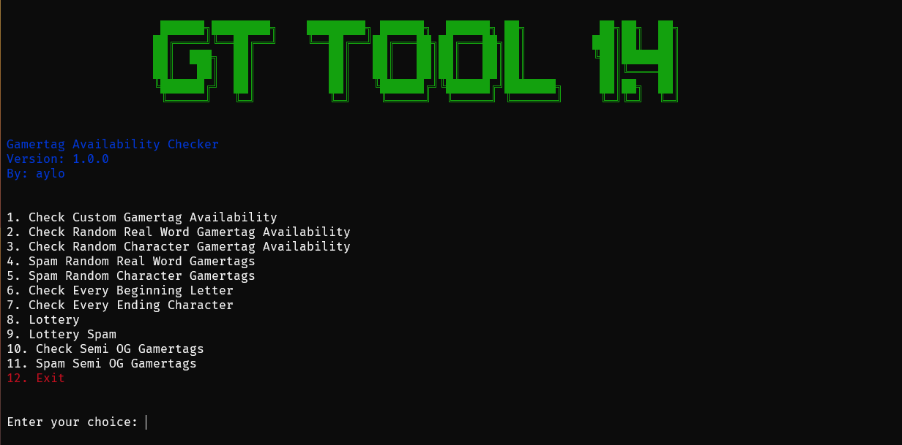

# Xbox Gamertag Tool

A Python tool for checking Xbox gamertag availability by scraping a gamertag checker website and utilizing various Python modules for additional features.

## Features
1. Check Custom Gamertag Availability
2. Check Random Real Word Gamertag Availability
3. Check Random Character Gamertag Availability
4. Spam Random Real Word Gamertags
5. Spam Random Character Gamertags
6. Check Every Beginning Letter
7. Check Every Ending Character
8. Lottery
9. Lottery Spam
10. Check Semi OG Gamertags
11. Spam Semi OG Gamertags

---

## Screenshots

| Toolie |
|--------|
|  |

## Installation
1. Clone the repository:
   ```sh
   git clone https://github.com/wuxnz/old-gamertag-tool.git
   cd old-gamertag-tool
   ```
2. Install dependencies:
   ```sh
   pip install -r requirements.txt
   ```

---

## Usage
1. Run the script:
   ```sh
   python toolie.py
   ```
2. Follow the on-screen instructions to check or spam gamertags.

---

## Contributions
Contributions to enhance functionality or optimize performance are welcome. Feel free to submit a pull request.

---

## License
This project is open-source and available under the MIT License.

